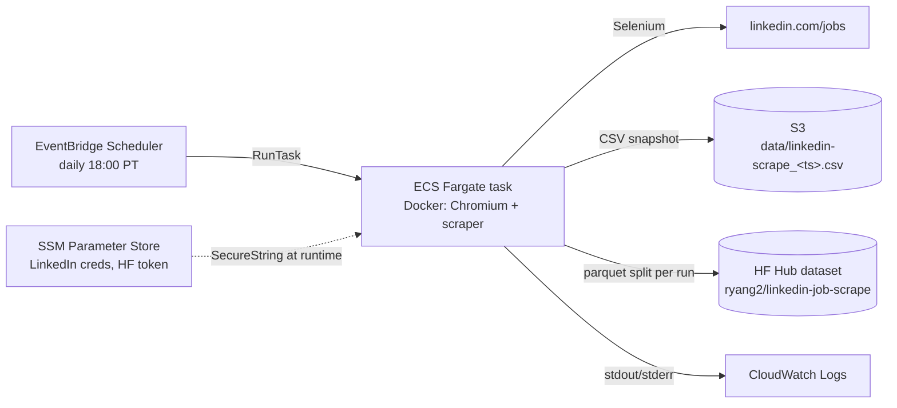

# LinkedIn DS/ML Job Scraper

An automated, serverless pipeline that scrapes data science / machine learning job postings from LinkedIn once a day and publishes them as a versioned public dataset: [`ryang2/linkedin-job-scrape`](https://huggingface.co/datasets/ryang2/linkedin-job-scrape) on Hugging Face Hub. Each run is an immutable snapshot — raw CSV in S3, a timestamped split on HF — building a longitudinal view of the DS/ML job market over time.

## Problem & Requirements

**Goal:** build a continuously growing, analysis-ready dataset of DS/ML job postings (titles, companies, locations, salaries, full descriptions) without manual effort.

**Functional requirements**
- Scrape a configurable search query daily; capture job metadata and descriptions
- Deduplicate jobs within a run (same posting appears across pages)
- Persist raw snapshots (audit trail) and publish a clean, versioned dataset
- Support ad-hoc local runs with a visible browser for debugging

**Non-functional requirements**
- Fully unattended: no machine that must be awake, no manual login per run
- No credentials in code, images, or env files — secrets fetched at runtime
- Resilient to LinkedIn's obfuscated/rotating DOM and bot detection
- Near-zero idle cost: pay only for the ~minutes/day the scraper runs

**Explicit non-goals:** cross-run deduplication (each snapshot is independent), real-time alerts, applying to jobs.

## Architecture



**One scrape cycle** (`src/scrape.py:main`):

1. **Credentials** — fetch LinkedIn username/password and HF token from SSM Parameter Store (SecureString, decrypted via the task role's KMS permission). Nothing sensitive ever lands on disk.
2. **Login** — headless Chrome with anti-automation hardening; reuses an active session if one exists, otherwise submits credentials and polls up to 120s so a 2FA/checkpoint challenge can clear.
3. **Search** — submits the query (default: `machine learning scientist, machine learning engineer, data scientist`) on `/jobs/`.
4. **Paginate & extract** — for up to `--num-pages` pages: scroll to load cards, click each unseen card, wait for the description panel, yield a `Job` record. A `seen` set on `job_id` dedups across pages; a 90s-per-page budget bounds slow pages.
5. **Publish** — write one CSV to S3 and push the same rows to HF Hub as a split named after the scrape timestamp (e.g. `2025_03_16_10_30`), plus a dataset README sync. Exit 1 (no uploads) if zero jobs were scraped, so a silent failure is visible to the scheduler.

## Key Design Decisions

| Decision | Alternatives considered | Rationale |
|---|---|---|
| **Selenium + real Chromium** | LinkedIn API; `requests` + BeautifulSoup | No public jobs API. The jobs page is a JS-rendered SPA behind auth and bot detection — a real browser fingerprint (custom UA, `AutomationControlled` disabled, `enable-automation` switch removed) is the only reliable path. |
| **Anchor on `componentkey`, not CSS classes** | CSS class / XPath selectors | LinkedIn obfuscates and rotates class names; `componentkey="job-card-component-ref-{job_id}"` and `JobDetails_AboutTheJob_{job_id}` are stable *and* carry the job ID for free — one attribute gives both the selector and the dedup key. |
| **ECS Fargate + EventBridge Scheduler** | Lambda; always-on EC2; local cron only | Chromium needs ~5 GB memory and a full browser runtime — over Lambda's practical size/memory fit, and a run can exceed comfort on its 15-min cap. An idle EC2 costs 24/7 for a job that runs minutes/day. Fargate is pay-per-run with zero idle cost. |
| **SSM Parameter Store for secrets** | env vars in task def; Secrets Manager | Encrypted at rest, IAM-scoped to the task role, free tier (vs Secrets Manager's per-secret cost), and keeps secrets out of task definitions and images entirely. |
| **Immutable timestamped snapshots** | Upsert into a database | Append-only CSVs + one HF split per run give a replayable audit trail and make longitudinal analysis (posting lifetimes, salary drift, reposts) possible. Tradeoff accepted: consumers dedup across runs themselves. |
| **Graceful degradation per field** | Fail the run on any parse error | A missing salary or logo shouldn't cost the other 200 jobs: absent fields become `"Not available"`, stale cards are skipped, a hung description panel logs and moves on. The run only fails (exit 1) when *nothing* was scraped. |
| **JS-injected clicks + human-ish delays** | Native `.click()`, no sleeps | Overlays cause `ElementClickInterceptedException`; `scrollIntoView` + JS click sidesteps it. Fixed 2–10s waits pace requests below bot-detection thresholds — crude but effective rate limiting for a once-daily, single-account workload. |

## Repository Layout

| Path | Responsibility |
|---|---|
| `src/scrape.py` | Entire pipeline: driver setup, login, search, pagination/extraction, S3 + HF publishing. Single file by design — one deployable unit, no internal API to version. |
| `Dockerfile` | `python:3.10-slim` + Debian `chromium`/`chromium-driver`; entrypoint runs the scraper. |
| `scripts/push_to_ecr.sh` | Build (linux/amd64) and push the image to ECR; creates the repo if absent. |
| `scripts/setup_ecs_schedule.sh` | Idempotent provisioning: ECS cluster, CloudWatch log group, task definition, EventBridge schedule (create or update). |
| `scripts/run_daily.sh` | Local wrapper: activates `.venv`, sources `.env`, logs to `logs/scrape.log`. Suitable as a launchd/cron target. |
| `infra/aws.env.example` | Template for all AWS deployment settings (account, roles, network, schedule). |
| `hf_dataset_readme.md` | Dataset card synced to HF Hub on every push. |

## Data Model

Each row is one job posting observed at scrape time (`Job` dataclass, all strings):

| Field | Notes |
|---|---|
| `job_id` | LinkedIn's internal ID, extracted from `componentkey` — dedup key within a run |
| `job_title` | Parsed from the card's `aria-label` (only stable title source) |
| `company_name`, `location`, `salary` | Positional parse of card text; `salary` filtered against metadata keywords ("promoted", "· ago", …) |
| `logo_url` | Company logo image URL |
| `job_description` | Full text of the "About the job" panel |
| `scrape_dt` | UTC run timestamp `YYYY-MM-DD-HH-MM` — the snapshot/version key |

**Storage layout**
- S3: `s3://<bucket>/data/linkedin-scrape_<scrape_dt>.csv` — one file per run, never overwritten
- HF Hub: one split per run (`scrape_dt` with `_`), parquet; dataset card defines train/test globs by year
- License: BigScience OpenRAIL-M — research/educational use only

## Configuration

**Environment variables** (see `.env.example`)

| Var | Purpose |
|---|---|
| `SSM_REGION` | Region for SSM Parameter Store lookups (required) |
| `S3_PREFIX` | S3 output prefix, e.g. `s3://<bucket>/data` (required) |
| `HF_REPO_ID` | Target HF dataset repo (required) |
| `CHROMEDRIVER_PATH`, `CHROME_BINARY` | Browser binary overrides (set by the Dockerfile; optional locally) |

**SSM SecureString parameters** (created once, out of band): `linkedin_user`, `linkedin_pwd`, `hf_hub_access_token`.

**CLI flags**: `-p/--prompt` (search query), `-n/--num-pages` (default 10), `--headless`/`--no-headless`, `--driver-path`, `--chrome-binary`.

## Running Locally

```bash
cp .env.example .env        # fill in SSM_REGION, S3_PREFIX, HF_REPO_ID
python3 -m venv .venv && source .venv/bin/activate
pip install -r requirements.txt

# one-off run with a visible browser (handy for 2FA and debugging)
set -a; source .env; set +a
python src/scrape.py --no-headless -n 2

# or via the wrapper (used for scheduled local runs, logs to logs/scrape.log)
./scripts/run_daily.sh
```

AWS credentials with SSM read + S3 write access must be available (`aws configure`). For recurring local runs, point launchd/cron at `scripts/run_daily.sh`.

## Deploying to AWS

1. **Prerequisites** — AWS CLI v2, Docker, `aws configure`; IAM roles:
   - task execution role (`ECS_TASK_EXEC_ROLE_ARN`) — pull from ECR, write logs
   - task role (`ECS_TASK_ROLE_ARN`) — `ssm:GetParameter`, `kms:Decrypt`, `s3:PutObject`
   - scheduler role (`SCHEDULER_ROLE_ARN`) — `ecs:RunTask`, `iam:PassRole`
2. **Configure** — `cp infra/aws.env.example infra/aws.env` and fill in account, roles, subnets, security groups, schedule.
3. **Ship the image** — `./scripts/push_to_ecr.sh infra/aws.env`
4. **Provision task + schedule** — `./scripts/setup_ecs_schedule.sh infra/aws.env` (idempotent; re-run to update). Default schedule: `cron(0 18 * * ? *)` in `America/Los_Angeles`, task sized 1 vCPU / 5 GB.
5. **Operate** — logs in the CloudWatch group from `LOG_GROUP`; ad-hoc run via `aws ecs run-task` against the registered task definition.

## Limitations & Future Work

- **No automated tests / CI** — DOM-dependent logic is hard to unit test meaningfully; the honest next step is recorded-page fixtures for the parsers plus a smoke test in CI.
- **Brittle to major LinkedIn redesigns** — `componentkey` anchoring survives class-name churn, but a structural redesign (it has happened) requires selector updates. Zero-jobs exit code is the current tripwire; alerting on task failure would shorten detection.
- **2FA in headless cloud runs** — the 120s challenge window is only actionable in local visible-browser mode; a cloud run hitting a checkpoint fails that day's snapshot. Session-cookie persistence would remove most re-logins.
- **No cross-run dedup or retention** — by design at the pipeline level, but consumer-side dedup helpers and an S3 lifecycle policy are cheap wins.
- **Single account, fixed pacing** — throughput caps at ~10 pages/day; scaling means smarter scheduling, not parallel accounts (ToS risk).
- **Downstream ML** — description parsing (skills/keyword extraction) has been prototyped with RAG offline; productionizing it is the natural next stage of the pipeline.