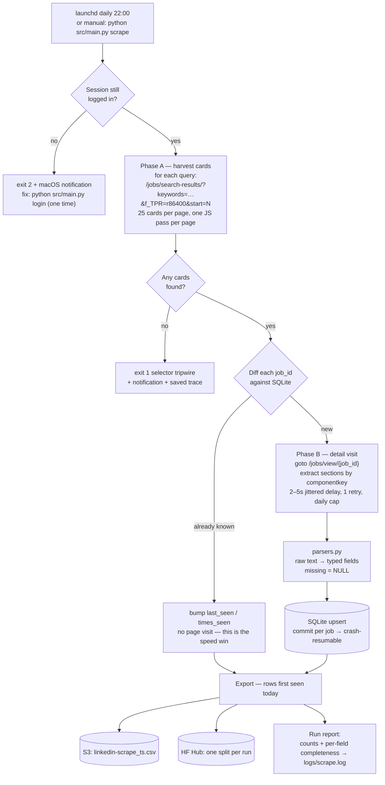

# LinkedIn Jobs Scraper

[](https://github.com/ryq99/linkedin-jobs-scraper/actions/workflows/ci.yml)
[](LICENSE)
[](https://www.python.org/)
[](https://huggingface.co/datasets/ryang2/linkedin-job-scrape)

A lightweight daily scraping pipeline for data science / machine learning jobs on LinkedIn — Playwright + SQLite, publishing an open dataset to the Hugging Face Hub.

## What You Get

One typed row per job posting — title, company, location, salary, full description, and every detail-page field LinkedIn exposes (see [Data Model](#data-model)). Real rows from the public dataset:

| job_title | company_name | location | salary_min | salary_max |
|---|---|---|---|---|
| Senior Machine Learning Engineer | Pacific Northwest National Laboratory | Seattle, WA | 140,200 | 228,800 |
| Applied ML Engineer - Media Search and Recommendation | Bloomberg | New York, NY | 165,000 | 260,000 |
| Sr. MLE, Prime Video - Personalization and Discovery | Amazon | Seattle, WA | 151,300 | 261,500 |

**Get the data without running anything**: [`ryang2/linkedin-job-scrape`](https://huggingface.co/datasets/ryang2/linkedin-job-scrape) on Hugging Face Hub — updated daily, one split per run.

## Quick Start

```bash
python3 -m venv .venv && source .venv/bin/activate
pip install -r requirements.txt && playwright install chromium
cp .env.example .env

python src/main.py login                                       # one-time: log in (incl. 2FA); session persists
python src/main.py scrape --headed --max-pages 2 --no-export   # watch a small dry run live
```

See [Running Locally](#running-locally) for exports, scheduling, and tests.

## Problem & Requirements

**Goal:** build a continuously growing, analysis-ready dataset of DS/ML job postings with the most complete and up-to-date schema from LinkedIn UI.

**Functional requirements**
- Scrape daily; capture card metadata, full descriptions, and every detail-page field available (salary, applicant insights, company insights, hiring team)
- Dedup across runs: never re-scrape a known job; track when each posting was first/last seen
- Persist locally (SQLite) and publish daily snapshots (S3 CSV + HF split)

**Non-functional requirements**
- Fast: less than 10 minutes per run — incremental visits, no fixed sleeps, blocked images/fonts
- Unattended on laptop: persistent login session (no per-run login/2FA), resumable after crash/sleep
- Data quality as a feature: typed schema, missing = NULL, per-field completeness metrics logged every run, parsers unit-tested against captured fixtures
- Resilient to LinkedIn DOM churn: anchor on stable `componentkey` attributes, tripwire exit codes, Playwright traces for post-mortem

## Architecture



**Key run behaviors** (what the diagram can't show):

- **Session**: Playwright opens a persistent Chromium profile (`chrome_user_data/`); the login cookie survives across runs, so scheduled runs never see a login page. Expired session → exit 2 + notification; one interactive `login` command fixes it.
- **Resumability**: every job is committed to SQLite individually — a run killed at job 40 of 120 resumes with 80 to go, and already-stored jobs are skipped by the diff.
- **Failure forensics**: every run records a Playwright trace; failed runs keep it in `logs/traces/` (`playwright show-trace <file>` replays every action with screenshots).
- **Data-quality tripwire**: the per-run completeness report means a LinkedIn UI change shows up as a visible drop (e.g. `salary_min: 0.62 → 0.0`) in the next morning's log, not as silent NULLs weeks later.

## Key Design Decisions

| Decision | Alternatives considered | Rationale |
|---|---|---|
| **Playwright + persistent Chromium profile** | Selenium (previous); requests + internal API | Auto-waiting removes fixed sleeps (the old run spent ~30s/page sleeping); request interception blocks images/fonts/media for 2–3× faster loads; bundled browser ends chromedriver/Chrome version mismatches; trace viewer gives replayable post-mortems of 10pm cron runs. Persistent profile removes the per-run login and the headless-2FA failure mode entirely. |
| **Logged-in scraping** | Guest/logged-out ("unbiased") | Personalization affects ranking, not set membership — scraping *all* pages of the past-24h window makes ordering moot. Guest sessions get authwalled within pages and lose every Premium field (applicant counts, seniority/education mix, company growth/tenure). |
| **SQLite as local system of record** | Stateless (previous); load all past CSVs per run | ~100 lines on stdlib `sqlite3`, one file. Powers incremental scraping (the biggest speed win: known jobs skip their 5–10s detail visit), `first_seen`/`last_seen`/`times_seen` tracking, and per-job commit = crash resumability. S3/HF stay as export sinks with unchanged contracts. |
| **Two-phase harvest → detail** | Click-through in the results pane (previous) | Card list gives ids + light fields cheaply; `/jobs/view/{id}` is a direct, stateless URL per job — no fragile in-pane clicking, trivially resumable, and the diff happens *between* phases so unchanged jobs cost nothing. |
| **URL-driven search + `f_TPR` time filter** | Typing queries, clicking Next (previous) | Keywords, past-24h filter, and `start=` pagination are all query params on `/jobs/search-results/` (verified live). Daily past-24h window + cross-run dedup ≈ complete coverage with minimal pages. |
| **Anchor on `componentkey` attributes** | CSS classes / XPath | Class names are obfuscated and rotate; `job-card-component-ref-{id}` and `JobDetails_*_{id}` are stable and carry the job id. Verified still intact on the current UI (2026-07). |
| **Missing = NULL + completeness metrics** | "Not available" sentinels (previous) | Typed NULLs keep downstream analysis honest; the per-run completeness report turns silent parser breakage (LinkedIn UI change) into a visible number drop the next morning. |
| **Local launchd, no cloud runtime** | ECS Fargate + EventBridge (previous) | A once-daily browser job doesn't need cloud orchestration; the persistent login session lives naturally on one machine; zero infra cost/maintenance. AWS remains only as a data sink (S3) + secret store (SSM for the HF token). |

## Repository Layout

| Path | Responsibility |
|---|---|
| `src/main.py` | Entrypoint + orchestration: `login` \| `scrape` \| `export` \| `stats` |
| `src/config.py` | Env vars + defaults (queries, window, caps, paths) |
| `src/browser.py` | Playwright persistent context, request blocking, login check, tracing |
| `src/crawler.py` | All LinkedIn DOM access — Phase A card harvesting + Phase B `/jobs/view/{id}` section extraction via `componentkey` |
| `src/parsers.py` | Pure text→field functions: card, top card, salary, insights, hiring team |
| `src/schemas.py` | `Job` dataclass — the full record schema |
| `src/store.py` | SQLite: `jobs` + `runs` tables, dedup, resumability, completeness metrics |
| `src/export.py` | S3 CSV + HF split push (same naming as the original pipeline) |
| `tests/` | Parser fixtures captured from the live site + store round-trip tests |
| `scripts/run_daily.sh` | launchd/cron wrapper (venv + `.env` + logging) |
| `infra/linkedin-scraper.plist.example` | launchd schedule template (daily 22:00) |

## Data Model

One row per job posting (`Job` dataclass → `jobs` table; missing values are NULL). The **Access** column marks where a field comes from: `Public` = visible without an account, `Login` = only visible signed in, `Premium` = requires a Premium subscription.

| Group | Access | Fields |
|---|---|---|
| Identity | Public | `job_id` (PK), `job_url`, `search_query`, `scrape_dt` |
| Core | Public | `job_title`, `company_name`, `location`, `workplace_type` (Remote/Hybrid/On-site), `employment_type`, `job_description`, `logo_url`, `verified_job` |
| Salary | Public | `salary_raw`, `salary_min`, `salary_max`, `salary_period` — parsed from card and/or description |
| Posting meta | Public | `posted_age_text`, `posted_at_estimate`, `is_reposted`, `benefits` |
| Posting meta | Login | `is_promoted`, `apply_type` (easy/external), `applicants_clicked` |
| Company | Public | `about_company` |
| Company insights | Premium | `company_headcount`, `headcount_growth_2y`, `median_tenure` |
| Applicant insights | Premium | `applicants_total`, `applicants_past_day`, `seniority_dist` (JSON), `education_dist` (JSON) |
| People | Login | `hiring_team` (JSON: name + title) |
| Store meta | Derived | `first_seen`, `last_seen`, `times_seen` |

**Privacy rule:** `Login` and `Premium` fields are gathered through a personal account and are personalized/gated — they stay in the local SQLite store and the private S3 snapshots only, and are **excluded from the public Hugging Face dataset** (`PRIVATE_FIELDS` in `src/schemas.py`, applied by `public_view()` in `src/export.py`).

**Exports**: S3 `{S3_PREFIX}/linkedin-scrape_{ts}.csv` (full schema, private bucket); HF one split per run (`ts` with underscores, **public fields only**), dataset card synced from `hf_dataset_readme.md`. License: BigScience OpenRAIL-M — research/educational use.

## Configuration

`.env` (see `.env.example`):

| Var | Purpose | Default |
|---|---|---|
| `SCRAPE_QUERIES` | Search queries, `;`-separated (queries may contain commas) | ML scientist/engineer + data scientist |
| `TIME_WINDOW` | `f_TPR` filter: `r86400` = 24h, `r604800` = week, empty = all | `r86400` |
| `MAX_PAGES` | Result pages per query (25 jobs/page) | `10` |
| `MAX_DETAIL_VISITS` | Per-run cap on detail-page visits (rate hygiene) | `300` |
| `S3_PREFIX` | S3 output prefix (export only) | — |
| `HF_REPO_ID` | HF dataset repo (export only) | — |
| `SSM_REGION` | Region for the `hf_hub_access_token` SSM parameter | `us-west-2` |
| `DB_PATH` / `PROFILE_DIR` | SQLite file / Chromium profile dir | `data/jobs.db`, `chrome_user_data/` |

Exit codes: `0` ok · `1` zero cards (selector tripwire) · `2` session expired (both also fire a macOS notification).

## Running Locally

```bash
python3 -m venv .venv && source .venv/bin/activate
pip install -r requirements.txt
playwright install chromium
cp .env.example .env    # fill in S3_PREFIX / HF_REPO_ID for exports

python src/main.py login                                       # one-time: log in (incl. 2FA); session persists
python src/main.py scrape --headed --max-pages 2 --no-export   # watch a small dry run live
python src/main.py scrape --window r604800                     # first real run: seed with past week
python src/main.py stats                                       # store overview
python src/main.py export --date 2026-07-18                    # re-export a day on demand
```

AWS credentials (`aws configure`) are needed only for exports (S3 write + SSM read of the HF token).

**Schedule:** copy `infra/linkedin-scraper.plist.example` to `~/Library/LaunchAgents/`, fix the two paths, `launchctl load` it. launchd runs the job at 22:00 daily (or on wake if the machine was asleep); output lands in `logs/scrape.log`. Failed runs save a Playwright trace to `logs/traces/` — inspect with `playwright show-trace <file>`.

**Run tests:** `pytest` — parsers are validated against text fixtures captured from the live site, so LinkedIn layout changes can be fixed by updating a fixture and re-running.

## Responsible Use

- **Rate hygiene is built in**: once-daily runs, incremental visits (known jobs are never re-fetched), a per-run detail-visit cap (`MAX_DETAIL_VISITS`), and jittered delays between page loads.
- **Personal-data boundary**: fields gathered through a logged-in/Premium session are personalized and gated — they never leave the local store and private S3 bucket, and are excluded from the public dataset (see the [Privacy rule](#data-model)).
- **Terms of service**: automated collection may conflict with LinkedIn's User Agreement. This project is provided for research and educational use; you are responsible for how you run it and for compliance with applicable terms and laws in your jurisdiction.
- **Licensing**: the code is [MIT](LICENSE); the published dataset ships separately under BigScience OpenRAIL-M (research/educational use).
